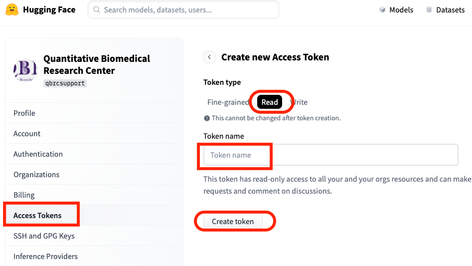
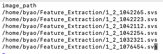
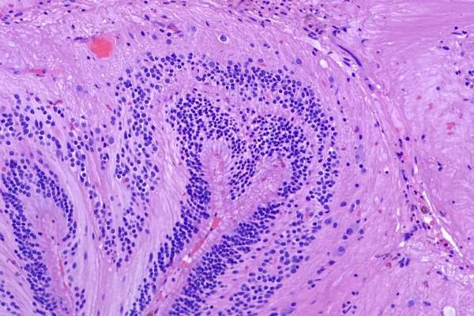

# Foundation Model Feature Extraction - QBRC Baseline

Author: Peiran Ruan (peiran.ruan@utsouthwestern.edu)

## Introduction

It is the standard code to extract the feature from whole slide image using any one Hugginface model from [Phikon](https://huggingface.co/owkin/phikon), [Phikon2](https://huggingface.co/owkin/phikon-v2), [prov-gigapath](https://huggingface.co/prov-gigapath/prov-gigapath), [UNI](https://huggingface.co/MahmoodLab/UNI) and [UNI2-h](https://huggingface.co/MahmoodLab/UNI2-h).

**You need to get approval from [prov-gigapath](https://huggingface.co/prov-gigapath/prov-gigapath), [UNI](https://huggingface.co/MahmoodLab/UNI) and [UNI2-h](https://huggingface.co/MahmoodLab/UNI2-h) before using it.**

**UNI2 is the recommended although it is big and slow**

You need to create an account on [HuggingFace](https://huggingface.co/). And generate a toket to access the model of Huggingface.

## Create Huggingface Account and Token

- Create an account on [HuggingFace](https://huggingface.co/join) 
- Create "Access Token" under your account profile

**Figure 1**: Create a 'read' token of HuggingFace account

## Create Conda Environment

Python > 3.8. Here Python 3.9 is used.

Use env/requirement.txt to create a Conda environment

- Install Minconda3 if not exists
- Create the Conda Environment "feature_extraction"
<pre>
conda create --name feature_extraction python=3.9
</pre>
- Install packages into the environment
<pre>
conda activate feature_extraction
pip install -r env/requirement.txt
conda install conda-forge::openslide
</pre>

## Set up Hugging Face token to use HuggingFace Model

Copy the huggingface token string from your Huggingface account. E.g. "hf****".

Change the line of 'main.py'.
<pre>
os.environ["HF_TOKEN"] = "hf_*****"   # add your hugging face token to run this script
</pre>

## User Guideline

- Create data input file (csv file). List the pathology file path in a csv file. The column name is "image_path". 

**The suggested image file type is svs or tiff**.

**The aboslution path is suggested**.

E.g. data.csv

- Quick start using the default settings

<pre>
python main.py --data_path "./data.csv" --output_feature "./out_feature" --output_corrds "./output_corrds"
</pre>

- Parameters to run the analysis: 

| Parameter | Description | Default Value |
| --------- | ----------- | ------------ |
| input_csv | image info csv file includes column 'image_path' | |
| feature\_save\_path| output folder for features per slide | ./output_feature |
| coords\_save\_path| output folder for features per slide | ./output_coords |
| batch_size | batch size | 256 |
| num_workers | number of workers | 64 |
| tile_size | number of tile | 224 |
| device | Run on cpu or gpu | cpu |
| input_mpp | Input data mpp | 0.5 |
| matter_threshold | A patch includes at least matter_threshold * 100% of tissue area | 0.6 |
| seed | Random seed | 100000 |
| max_tiles | number of tiles to extract | None |
| temp_dir | temp dir for saving patches, will delete once finish (if None, the temp dir name is a UUID) | None |
| model_name | Model name | phikon |

## Input File

Pathology Image Files. E.g.

## Output File

- Feature Extraction File: npy file
- Coordinates File: csv file

## Troubleshooting

## Reference
https://www.kaggle.com/code/jbschiratti/winning-submission

## License
Following UT Southwestern Office for Technology Development, the project is using the license from The University of Texas Southwestern Medical Center.
